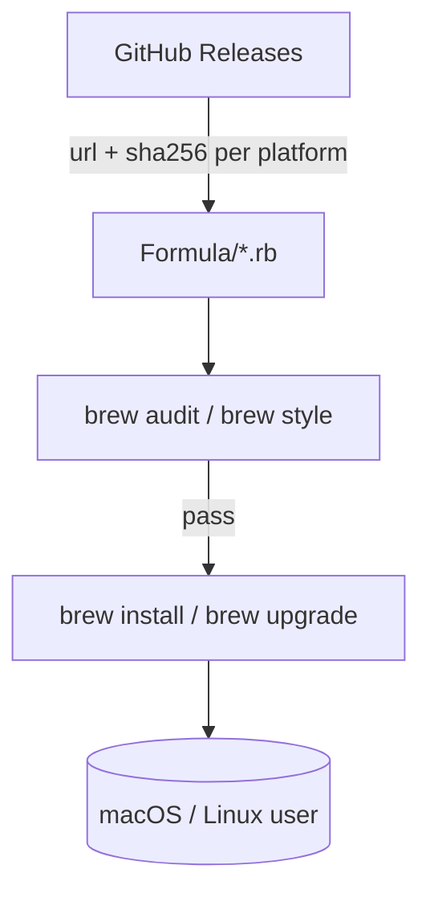

# Homebrew Tap

[](https://github.com/clouatre-labs/homebrew-tap/actions/workflows/audit.yml)
[](https://api.reuse.software/info/github.com/clouatre-labs/homebrew-tap)
[](LICENSE)

Homebrew tap for [clouatre-labs](https://github.com/clouatre-labs) projects.

## Installation

```bash
brew tap clouatre-labs/tap
```

## Available Formulas

| Formula | Description |
|---------|-------------|
| [aptu](https://github.com/clouatre-labs/aptu) | Gamified OSS issue triage with AI assistance |
| [aptu-coder](https://github.com/clouatre-labs/aptu-coder) | MCP server for code structure analysis using tree-sitter |

## Architecture



*Figure 1: Every formula pins a release tarball and SHA-256 per platform from
its upstream GitHub release. Formulas are validated with `brew audit`/`brew
style` and consumed via `brew install clouatre-labs/tap/<formula>`.*

## Usage

Install a formula:

```bash
brew install clouatre-labs/tap/aptu
```

Or after tapping:

```bash
brew install aptu
```

## Updating

```bash
brew update
brew upgrade aptu
```

## Contributing

1. Fork this repository
2. Create a feature branch
3. Make your changes
4. Run `brew audit --strict --online Formula/<formula>.rb`
5. Run `brew style Formula/<formula>.rb`
6. Submit a pull request

## License

Each formula specifies its own license. See individual formula files for details.
Repository metadata is licensed [Apache-2.0](LICENSE) — see [REUSE.toml](REUSE.toml).
